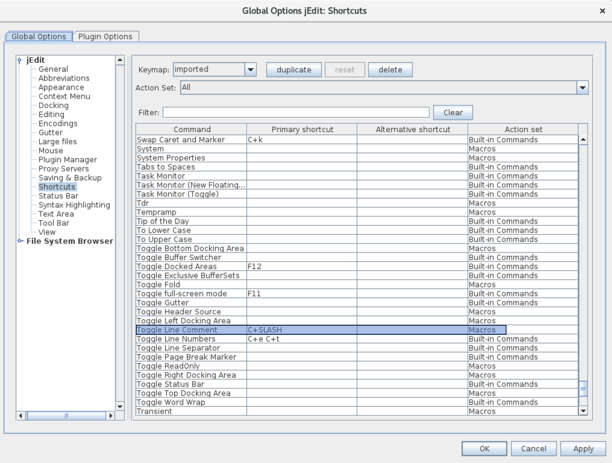

# jEdit Toggle Line Comment (BeanShell Macro)

一个适用于 **jEdit 5.5** 的轻量级 sentaurus BeanShell Macro，实现类似 VS Code 的：

> Ctrl + / 行注释 / 取消注释（Toggle）

无需 TextTools 等插件。

---

# 为什么需要这个 Macro？

jEdit 自带：

> Line Comment 依赖 Edit Mode 的 lineComment 属性

问题：

- Sentaurus mode 常常没有正确配置 lineComment
- 不同文件（.scm / .cmd）注释规则不同
- 原生 Line Comment 可能“无反应”

👉 本 Macro 直接绕过该限制

---
# 功能说明

## ✅ 核心功能

- 一键切换行注释 / 取消注释
- 支持：
  - 选中多行
  - 未选中（当前行）
- 自动识别注释符
- 保留缩进
- 支持 Undo 一步撤销

---

## 📄 不同文件的注释规则

Macro 会按以下优先级选择注释符：

### ① 优先使用 jEdit 当前语言模式（lineComment）

如果 Edit Mode 定义了：

```text
lineComment
```

则直接使用，例如：

- Java → `//`
- Python → `#`

---

### ② Sentaurus / 无 lineComment 时的 fallback

| 文件类型 | 注释符 |
|----------|--------|
| `.scm`   | `;`    |
| `.cmd`   | `#`    |
| `.des`   | `#`    |
| `.par`   | `*`    |
| `.tdr`   | `#`    |
| 其他     | `#`    |

---

## 📌 示例

### ①Sentaurus command 文件

```text
Physics {
    Mobility(DopingDependence)
}
```

→

```text
# Physics {
#     Mobility(DopingDependence)
# }
```

---

### ②sde 文件 (_dvs.cmd)

```scheme
(sdegeo:create-rectangle ...)
```

→

```scheme
; (sdegeo:create-rectangle ...)
```

---

# 安装方法

## 1. 放入 Macro 目录

将bash文件(Toggle_Line_Comment.bsh)放入.jedit里的macros：

```text
jEdit .jedit/macros/
```

结构如下：

```text
macros/
└── Toggle_Line_Comment.bsh
```

---

## 2. 重启 jEdit

打开：

```text
Macros → Toggle_Line_Comment
```

确认可见即安装成功。

---

# 快捷键设置（推荐 Ctrl + /）

操作：

```text
Utilities → Global Options → 找到Toggle Line Comment
```

设置：

```text
Toggle_Line_Comment → Ctrl + /
```



⚠️ 如果冲突，先删除原绑定。

---

# 使用方法

## ✅ 注释

```text
Physics {
    Mobility(DopingDependence)
}
```

按 `Ctrl + /`

↓

```text
# Physics {
#     Mobility(DopingDependence)
# }
```

---

## ✅ 取消注释

再次按 `Ctrl + /`

↓

```text
Physics {
    Mobility(DopingDependence)
}
```

---

## ✅ 单行

光标所在行自动处理：

```text
Mobility(DopingDependence)
```

↓

```text
# Mobility(DopingDependence)
```


---


# 卸载方法

## 1. 删除快捷键

```text
Shortcuts → Toggle_Line_Comment → Remove Ctrl + /
```

---

## 2. 删除文件

```text
macros/Toggle_Line_Comment.bsh
```

---

## 3. 重启 jEdit

---

# 适用场景

- Sentaurus TCAD
- jEdit 5.5
- 多语言混合工程
- 无插件环境

---

# License

MIT / Free to use and modify

---

# Author

Designed for practical Sentaurus + jEdit workflow improvement
